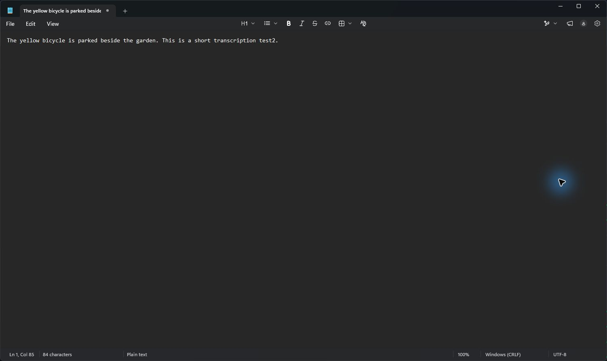
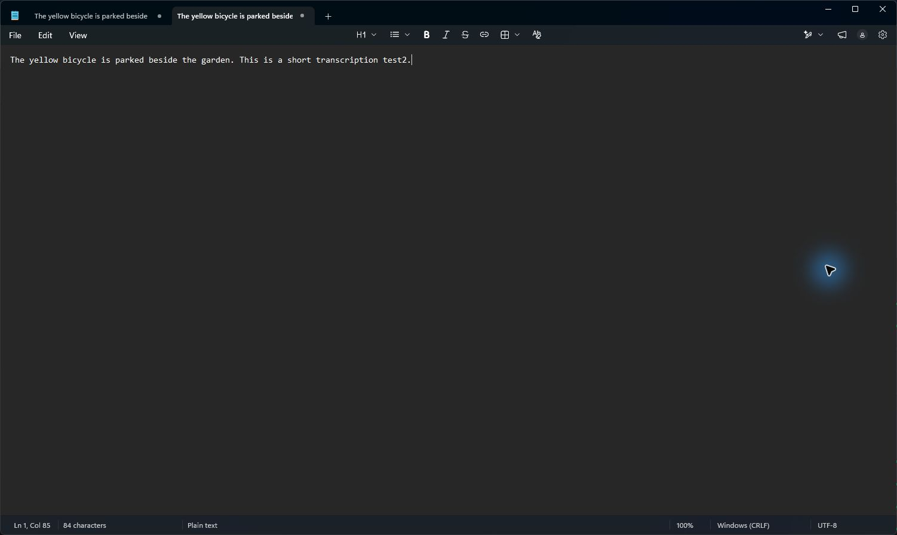
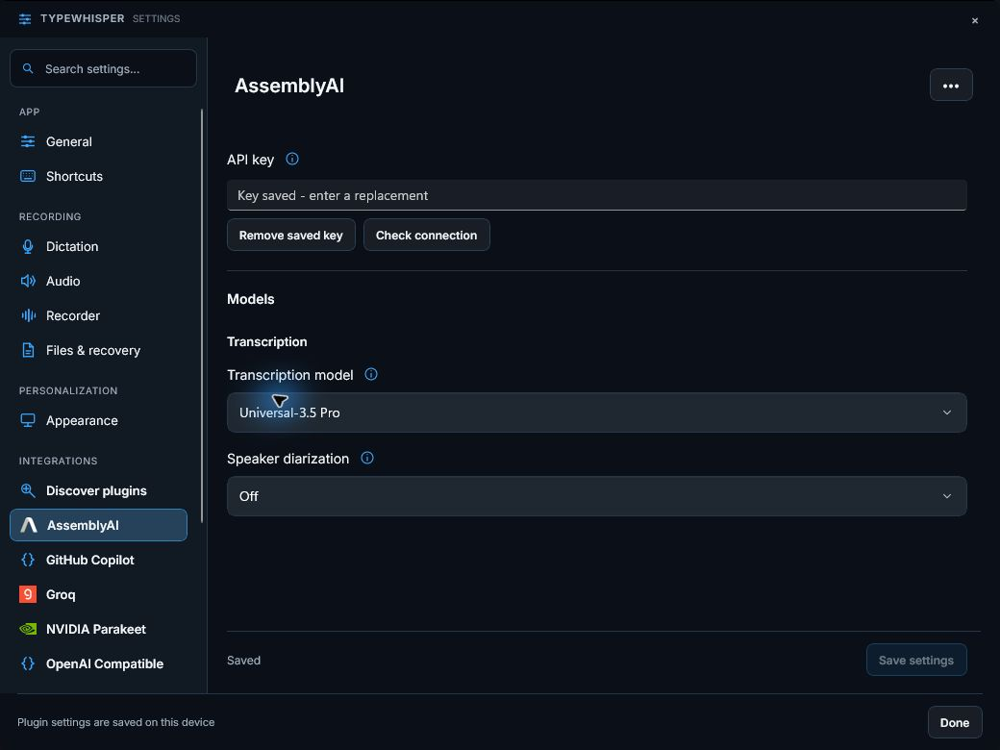

# AssemblyAI microphone-to-paste evidence

Captured on September 14, 2026 in the local Windows console session with the installed portable AssemblyAI 1.1.0 package and Universal-3.5 Pro.

The automated test played locally synthesized English speech through Creative Pebble Pro speakers. The physical microphone path (Windows default: HyperX QuadCast 2) supplied an 8.76-second recording to the running app's normal dictation API. The raw transcript exactly matched:

> The yellow bicycle is parked beside the garden. This is a short transcription test.

The existing enabled dictionary correction `test` → `test2` explains the final word in Notepad. Paste diagnostics reported completed delivery, and the actual document was inspected visually. No expected text was typed into the target by the test driver. The prior NVIDIA selection and audio-ducking preference were restored.

The committed `Test-WinUILocalAudio.ps1` script was then run successfully against a second blank document with the same physical devices and model. Its raw-text assertion passed, model restoration succeeded, and the pasted result was inspected:

These runs establish physical-audio transcription and paste, but not physical-hotkey coverage or general recognition accuracy. The shared host output had been replaced by a different checkout before these runs; the installed AssemblyAI package remained unchanged.

The development launcher subsequently rebuilt this PR's checkout. The published host DLL hash matched the local build, and the dark settings page and official AssemblyAI logomark were inspected in that host. The empty replacement field indicates a saved key without exposing it. Light-theme layout remains unverified.

Only reviewed UI screenshots are committed; credentials, local discovery state and microphone audio are excluded.

Reproduce with [the local audio test workflow](../../WINUI-LOCAL-AUDIO-TEST.md) and `eng/Test-WinUILocalAudio.ps1`.
