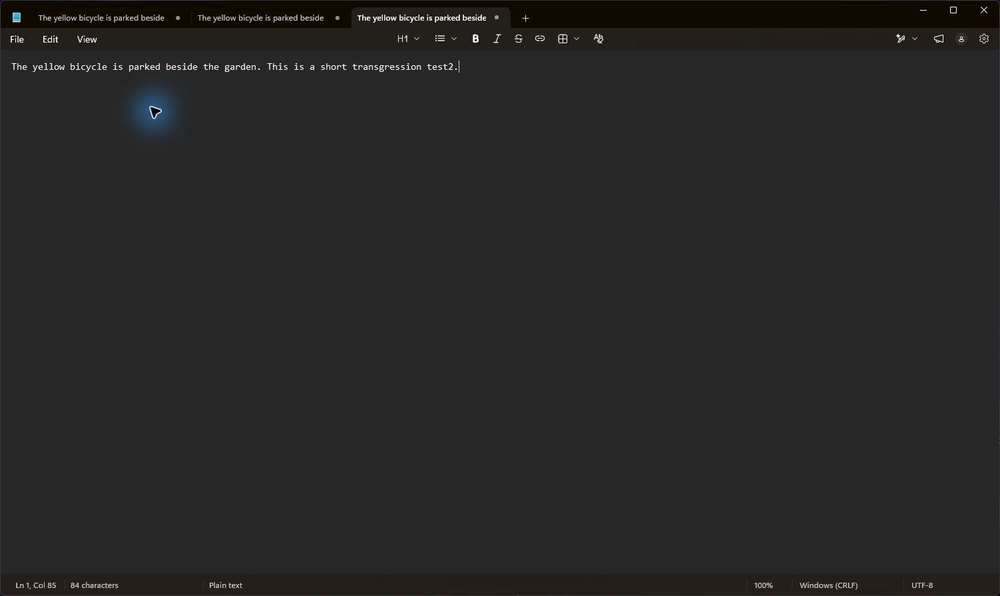

# Qwen3 local microphone and paste evidence

Captured on 2026-09-15 in the prescribed Windows x64 development host, with plugin
commit `08b899e5083d6f77312513caca13945fb313195b` installed. The subsequent selection
persistence fix does not change audio decoding; its restart behavior has separate
automated coverage.

## Route and result

- Local console session; Creative Pebble Pro speakers → HyperX QuadCast 2 microphone.
- `eng/Test-WinUILocalAudio.ps1 -Mode Run`, provider `qwen3-local`, model
  `qwen3-asr-0.6b-int8`, automatic language, no LLM workflow.
- Locally synthesized input: "The yellow bicycle is parked beside the garden. This
  is a short transcription test."
- A new empty Notepad tab was observed before recording. No expected text was typed
  into the document. The host completed the 8.66-second microphone recording using
  the requested provider/model and reported Notepad as its target.
- Raw result: "The yellow bicycle is parked beside the garden. This is a short
  transgression test."
- Final and visibly pasted result: "The yellow bicycle is parked beside the garden.
  This is a short transgression test2." An existing dictionary rule changed `test`
  to `test2`.

The script **failed its exact raw-transcript assertion**. Capture, local inference
and paste completed, but this sample is not a passing accuracy check. A direct
file check of the synthesized input also produced a capitalization/word-splitting
error in "transcription", so microphone capture alone does not explain all errors.
The expected result and assertion were not changed to hide the mismatch.

The screenshot proves the visible inserted text for this run. It does not establish
general recognition accuracy, physical hotkeys, or ARM64 execution. Temporary
microphone selection and audio-ducking preferences were restored after the test.
Raw microphone audio and profile data remain outside the repository.
