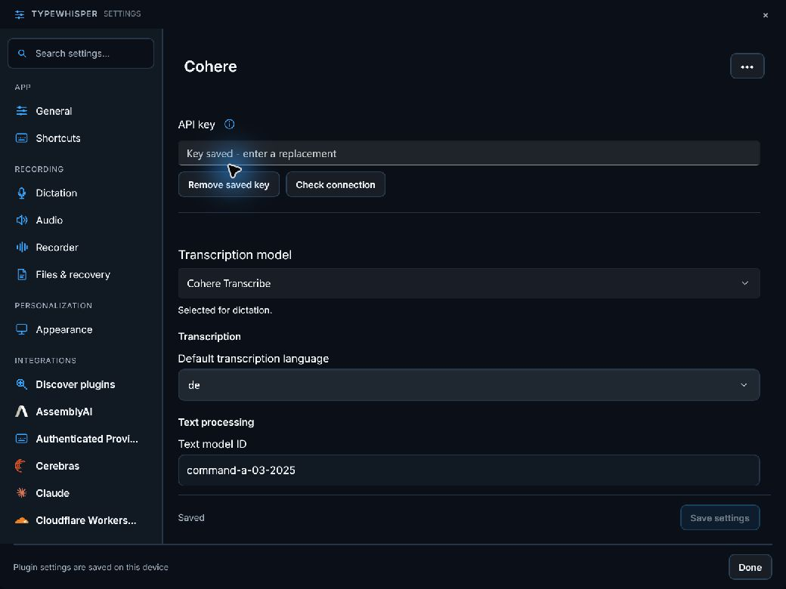
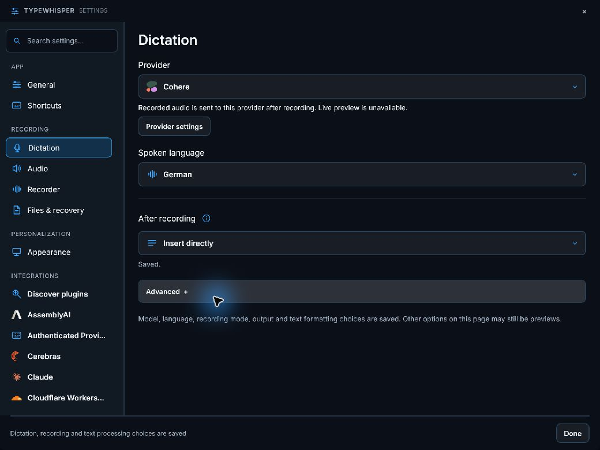

# Cohere for the portable host

Independent .NET 10 package `com.typewhisper.cohere`, version `1.1.3`, requiring host `1.1.2`. Implemented on its own `seofood/cohere-portable` branch, originally based on Windows `4db8f6ac` and updated with current main. No other migration branch is required. Legacy code, projects, manifests and published catalogs remain unchanged.

## Behavior and macOS comparison

Preserves Windows Command text processing and adds the cloud Cohere Transcribe capability present in the Mac plugin. Includes 14 supported language choices, explicit default language, text model selection and temperature. Connection validation uses the documented `/v1/models` endpoint.

The corresponding Mac sources were inspected at `ac00e39e` in `TypeWhisperPluginSDK/Plugins/`. The Mac `CoherePlugin` is now transcription-only. The separate local `CohereTranscribe`/macOS `CohereLocal` engine is not this cloud provider. Dictionary hints and real-time transcription are not advertised.

Setup: **API key; choose the default transcription language**. Settings are rendered by the host in English/German. API keys use the host secret store, with a staged encrypted-key reference and one configuration commit. Failed writes keep the active configuration. Removing a key retains nonsecret preferences. No legacy credentials or settings are imported. Redirects are disabled and provider HTTP failures retain status/retry metadata. Opening the settings page sends no network request.

Version 1.1.3 additionally excludes invalid restored model IDs from the model list and reports typed configuration failures for those models and invalid saved fallback languages before HTTP. Version 1.1.2 rejects model IDs exceeding the request limit when saving, and reports a typed configuration failure for invalid restored custom temperatures before sending a request. Regression tests cover both cases.

## Verification

```powershell
dotnet test plugins-v2/TypeWhisper.Plugin.Cohere/Tests/TypeWhisper.Plugin.Cohere.Portable.Tests.csproj -c Release
dotnet msbuild plugins-v2/TypeWhisper.Plugin.Cohere/portable.proj '-t:Build;CopyPackage' -p:Configuration=Release -p:PluginDestination=<staging-directory>
```

All **48 provider tests passed**. The provider test suite covers protocol requests/responses, HTTP errors, malformed JSON, cancellation, key persistence/failure/removal, host settings rendering and independent ZIP installation/configuration/restart/uninstall/reinstall through the immutable portable store. The resulting package contains only the provider DLL, dependency manifest and plugin manifest, with no WPF dependencies. The unchanged portable SDK/host baseline passed all 259 tests in the Gemini checkout.

On 2026-09-18, the ZIP was installed in the Windows development profile and loaded with the real portable host services and Windows secret-store implementation. Settings were read successfully and the plugin was enabled. Existing unrelated package receipts were preserved. The WinUI development build and launch succeeded. No authenticated provider requests were sent. Native visual inspection was unavailable because the computer-use service could not connect.

On 2026-09-19, authenticated validation, recorded-audio transcription and Command A text processing passed with synthetic test data. Live testing exposed and fixed Cohere's requirement to place scalar multipart fields before the audio file, and Command A's 8192-token output limit. The published language list was corrected to the 14 languages documented for Cohere Transcribe, and malformed German text was repaired. Uploads larger than 25 MB are rejected locally.

The development package was upgraded from 1.1.0 to 1.1.1 with unrelated installation receipts preserved. Native branding is included on this independent branch, and the shared settings host supplies the single Save settings action. Cohere's uploaded-audio API requires an explicit language; the plugin uses its configured default when the host requests Automatic. Realtime dictation is not advertised.

The development app was inspected with Cohere selected for dictation, German selected under Spoken language, and `de` saved as the provider default using the shared Save settings button. Settings and provider selection screenshots are included. Marco confirmed normal microphone dictation in the app on 2026-09-19. Workflow UI execution and ARM64 execution remain pending. No public package or catalog was published.

Reference: [provider documentation](https://docs.cohere.com/docs/audio-transcription-quickstart).




