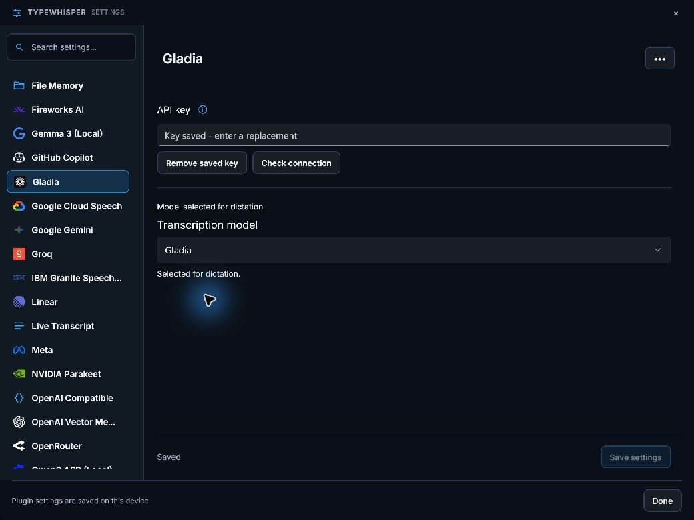
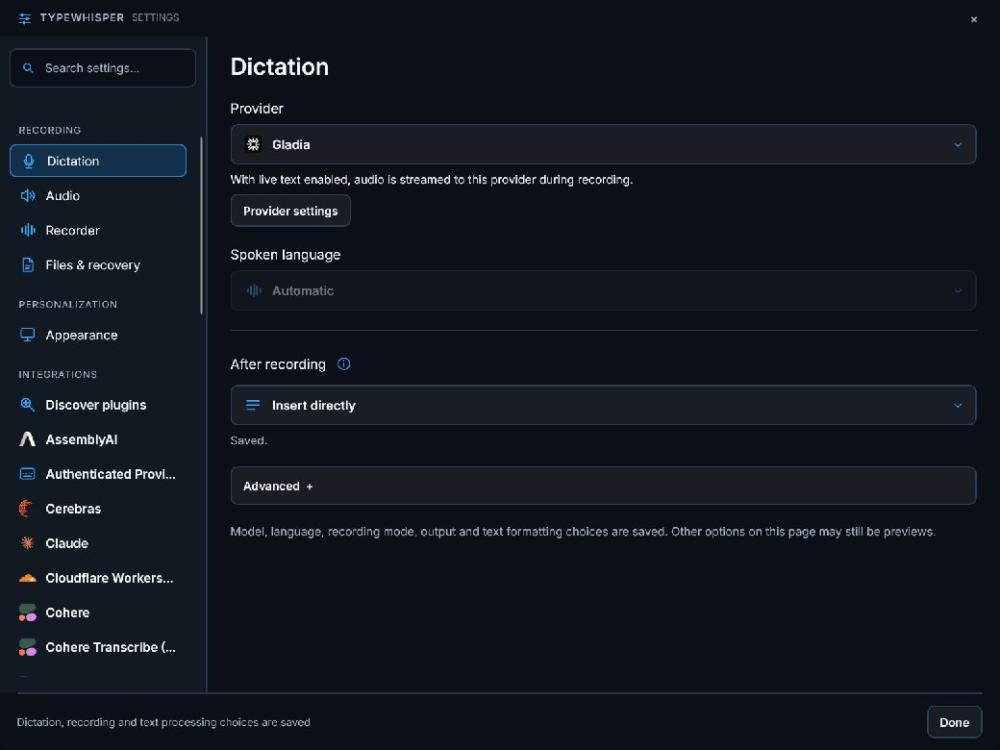
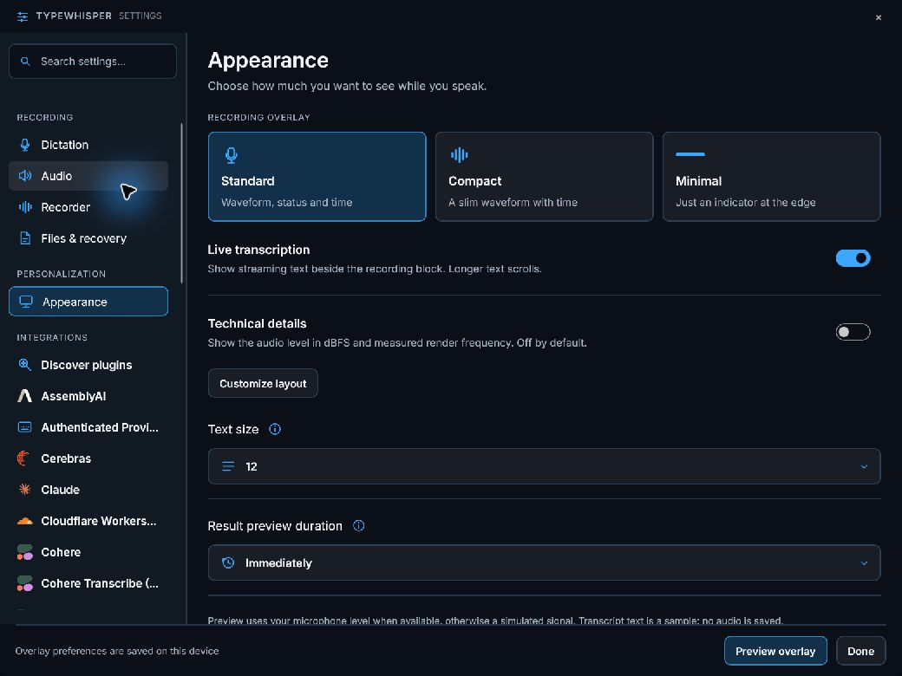
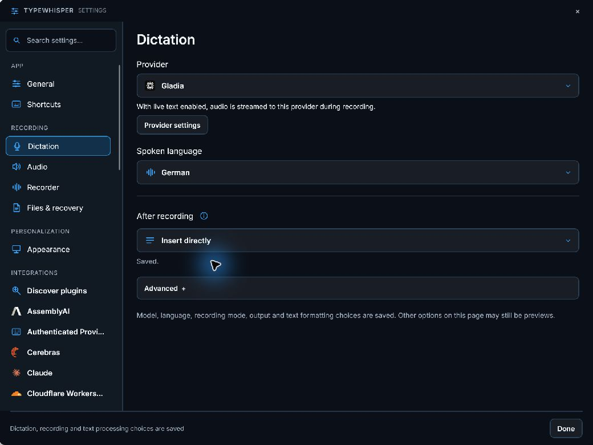

# Gladia for the portable host

Independent .NET 10 package `com.typewhisper.gladia`, version `1.2.3`, requiring host `1.1.5`. Implemented on its own `seofood/gladia-portable` branch, originally based on Windows `4db8f6ac` and updated with current main before review. No other migration branch is required. Legacy code, projects, manifests and published catalogs remain unchanged.

## Behavior and macOS comparison

Corrects the legacy single-request assumption: upload audio, submit an asynchronous transcription job and poll its result. Ports ordered language hints/code switching and the Mac custom-vocabulary configuration, with bounded polling and cancellation.

The corresponding Mac sources were inspected at `ac00e39e` in `TypeWhisperPluginSDK/Plugins/`. The Windows live path uses Gladia V2 (`solaria-1`): authenticate `POST /v2/live`, validate the returned secure Gladia WebSocket URL, then send mono 16 kHz PCM16 chunks. Ordered language hints and custom vocabulary are preserved. Partial utterances replace the preview; confirmed utterances are emitted once. Stop sends `stop_recording` and waits for `end_session`. Incomplete or interrupted sessions fail so the host can use its retained recording as fallback. Uploaded recordings follow the provider retention policy; no automatic remote deletion is claimed.

Setup: **Gladia API key**. Settings are rendered by the host in English/German. API keys use the host secret store, with a staged encrypted-key reference and one configuration commit. Failed writes keep the active configuration. Removing a key retains nonsecret preferences. No legacy credentials or settings are imported. Redirects are disabled and provider HTTP failures retain status/retry metadata. Opening the settings page sends no network request.

Version 1.2.2 constructs the polling endpoint from the returned job UUID, reads duration from result metadata, and updates the provider description. Regression fixtures use the documented submission response and assert the complete upload/submit/poll sequence. An isolated authenticated test of the built 1.2.2 package passed configuration validation and recorded-audio transcription with the full expected text and 5.088 seconds of metadata duration; it did not replace the running development package.

## Verification

```powershell
dotnet test plugins-v2/TypeWhisper.Plugin.Gladia/Tests/TypeWhisper.Plugin.Gladia.Portable.Tests.csproj -c Release
dotnet msbuild plugins-v2/TypeWhisper.Plugin.Gladia/portable.proj '-t:Build;CopyPackage' -p:Configuration=Release -p:PluginDestination=<staging-directory>
```

All **52 provider tests passed** (including 27 streaming cases). The provider test suite covers protocol requests/responses, HTTP errors, malformed JSON, cancellation, key persistence/failure/removal, host settings rendering and independent ZIP installation/configuration/restart/uninstall/reinstall through the immutable portable store. The resulting package contains only the provider DLL, dependency manifest and plugin manifest, with no WPF dependencies. The unchanged portable SDK/host baseline passed all 259 tests in the Gemini checkout.

On 2026-09-19, all 20 provider tests passed again. The installed 1.1.0 package loaded through the real portable host using the development profile's Windows secret store. Authenticated configuration validation and recorded-audio transcription passed with a short synthetic English WAV. The result was: "This is a short test. Tomorrow we will meet at 10 in the office."

The combined development app was inspected visually: Gladia branding, a saved-key placeholder, the model selector and the shared Save settings action are present. The host-side Gladia logo mapping and SVG are included on this independent branch; the shared Save behavior comes from #479 and provider-selection logos from #482. Gladia was selected for the next manual dictation test. No credential values are included in the screenshot.

Marco confirmed recorded-audio dictation in the app on 2026-09-19. The development profile was then upgraded from 1.1.0 to 1.2.0 through the immutable portable store; unrelated package receipts were verified unchanged. Two authenticated streaming runs (built package and installed package) used the existing Windows secret store and synthetic English audio through `StreamingDictation`. Both delivered previews during capture and the complete expected result without fallback. The installed run delivered its first preview after 719 ms and ten previews before stop.

The restarted development app shows Gladia selected for dictation and the Live transcription toggle enabled. Settings screenshots are included below.

Streaming tests cover authenticated session initialization, PCM format/chunk ordering, language/vocabulary configuration, endpoint validation, fragmented messages, replacement partials, duplicate final suppression, final-utterance delivery, typed provider errors, malformed/premature closure, cancellation and completion timeout. Marco confirmed live microphone transcription on 2026-09-19. Version 1.2.1 also exposes Gladia's documented language codes to the host, enabling the Spoken language selector. A single selection is sent as a fixed language with code switching disabled; Automatic keeps provider detection. The restarted development app exposes the language selector; German was selected and verified persisted as `de`. Marco also confirmed that German live dictation works better with the explicit language selection. ARM64 execution remains pending. No public package or catalog was published.









References: [live quickstart](https://docs.gladia.io/chapters/live-stt/quickstart), [session configuration](https://docs.gladia.io/api-reference/v2/live/init), [WebSocket protocol](https://docs.gladia.io/api-reference/v2/live/websocket).

Dictionary terms use the structured host contract 1.1.5 or newer, preserving literal commas inside each entry. Older plugin packages keep their original prompt contract.
